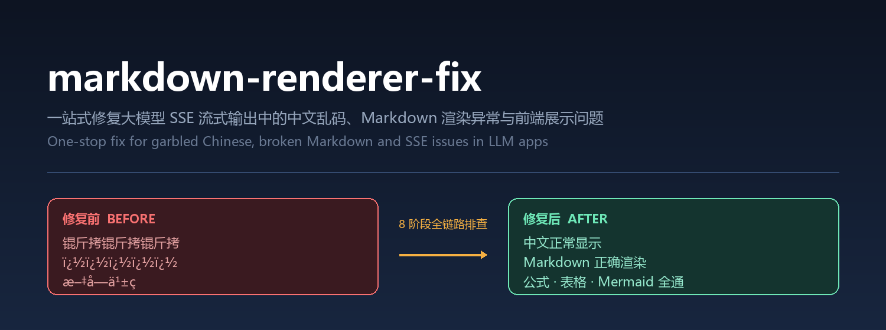
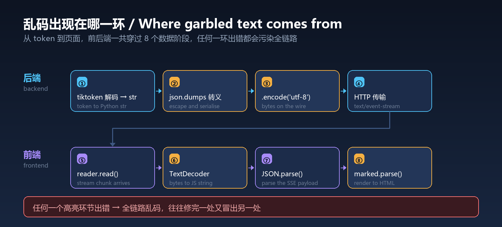

<div align="center">



**One-stop fix for garbled Chinese, broken Markdown and streaming issues in LLM apps**

[](LICENSE)
[](CHANGELOG.md)
[](https://github.com/YardonYan/markdown-renderer-fix)
[](#quick-start)
[](https://yardonyan.github.io/markdown-renderer-fix/)
[](#diagnostic-command)

[中文](README.md) · **English**

</div>

---

> No matter how good your model's answer is, a single `锟斤拷` can ruin the whole experience. This skill fixes it at the root — full-stack stage-by-stage diagnosis plus production-ready templates.

## Table of Contents

- [Why You Need This](#why-you-need-this)
- [Screenshots](#screenshots)
- [What This Is](#what-this-is)
- [Quick Start](#quick-start)
- [Diagnostic Command](#diagnostic-command)
- [Documentation](#documentation)
- [Release Highlights](#release-highlights)
- [File Structure](#file-structure)
- [Troubleshooting](#troubleshooting)
- [Contributing](#contributing)
- [License](#license)

---

<a id="why-you-need-this"></a>

## Why You Need This

SSE streaming plus Chinese text plus Markdown rendering looks simple, but the data actually crosses **8 distinct stages** between the backend and the frontend:



**A failure in any one stage corrupts the entire chain.** Developers typically fix one stage only to watch the problem resurface elsewhere, burning hours on diagnosis.

This skill gives you four things:

- **A decision tree** — pinpoint which of the 8 stages is actually broken, fast
- **Ready-to-paste fixes** — a copy-paste solution for every common root cause
- **Production templates** — a complete chat UI with all fixes already wired in
- **11 verification checks** — test cases that prove the fix really works

---

<a id="screenshots"></a>

## Screenshots

### Demo gallery overview

Six cards in a Monet-garden palette, covering plain text, syntax highlighting, tables, math formulas, Mermaid diagrams, and mixed content.


### Syntax highlighting with a card expanded

Expanded Python code with blue keywords, green strings, and a language tag in the top-right corner.


### Rendered Mermaid diagram

A rendered flowchart inside an expanded card, with rounded node borders and connecting arrows.


---

<a id="what-this-is"></a>

## What This Is

An **AI Skill** — a reusable instruction module that OpenClaw loads automatically when it detects Markdown rendering or encoding issues.

**The HTML templates and Python script work completely standalone**, though:

| Component | Description | Standalone |
|:----------|:------------|:-----------|
| `assets/chat_template.html` | Full chat UI (SSE + Markdown + highlighting + math) | Yes, needs a local HTTP server |
| `assets/index.html` | Markdown rendering gallery (8 sample cards) | Yes, opens straight in a browser |
| `scripts/diagnose_encoding.py` | Multi-mode encoding health check | Yes, run with `python` |
| `SKILL.md` + `references/` | AI-facing guidance | Requires an OpenClaw environment |

<a id="quick-start"></a>

## Quick Start

> Live demo: [GitHub Pages Demo](https://yardonyan.github.io/markdown-renderer-fix/)

### Using the installer (recommended)

The repo ships a zero-dependency installer that copies the skill into the skills directory of each AI app on your machine:

```bash
node tools/install.mjs --list                 # list available targets
node tools/install.mjs --ai workbuddy         # install into WorkBuddy
node tools/install.mjs --ai all               # every target
node tools/install.mjs --ai all --dry-run     # preview only, writes nothing
```

Targets verified to exist on a real machine: WorkBuddy, TRAE China edition, CodeBuddy, Claude Code, Codex CLI, OpenClaw, Qwen Code, cc-switch.

### Installing as a plugin (WorkBuddy / CodeBuddy / Claude Code)

The repository root carries `.codebuddy-plugin/` and `.claude-plugin/` manifests, so it can be registered directly as a single-plugin marketplace and installed as a plugin rather than by copying directories.

The field names and values follow the manifests shipped inside the apps themselves — this is not a format of my own invention. **The file format was checked field by field against the apps' own bundled marketplaces; the end-to-end register-and-load flow has not been verified.** Where you register it depends on the version you have.

Regenerate the manifests after changing the `name` or version in `SKILL.md`:

```bash
node tools/build_plugins.mjs .
```

### Manual use

```bash
# 1. Clone
git clone https://github.com/YardonYan/markdown-renderer-fix.git

# 2. Preview chat_template.html locally (needs an HTTP server; file:// will not work)
cd markdown-renderer-fix/assets
py -m http.server 8080
# Open http://localhost:8080/chat_template.html

# 3. Preview the demo gallery (no server needed)
open assets/index.html      # macOS
start assets/index.html     # Windows
xdg-open assets/index.html  # Linux

# 4. Run a diagnosis against your own server
python scripts/diagnose_encoding.py --full
```

<a id="diagnostic-command"></a>

## Diagnostic Command

```bash
# Full scan (environment + tiktoken + framework + CDN + live SSE test)
python scripts/diagnose_encoding.py --full

# Test a real SSE endpoint
python scripts/diagnose_encoding.py --real-sse --endpoint http://127.0.0.1:18765/api/chat/stream

# Check whether CDN dependencies are reachable
python scripts/diagnose_encoding.py --deps

# Provide your own Chinese test string
python scripts/diagnose_encoding.py --test-text "你好世界" --full
```

<a id="documentation"></a>

## Documentation

### Entry points

| Document | When to read |
|:---------|:-------------|
| [SKILL.md](SKILL.md) | Start here — decision tree plus quick-fix table |
| [CHANGELOG.md](CHANGELOG.md) | Version history |

### Seeing garbled text?

| Document | Contents |
|:---------|:---------|
| [encoding_fix.md](references/encoding_fix.md) | tiktoken root causes, GBK/UTF-8 mixing, tokenizer compatibility |
| [troubleshooting.md](references/troubleshooting.md) | Six-step stage-by-stage diagnosis handbook |

### Markdown rendering problems?

| Document | Contents |
|:---------|:---------|
| [markdown_render.md](references/markdown_render.md) | Marked.js configuration, render pipeline, tool-call filtering |
| [performance.md](references/performance.md) | Incremental rendering, throttling, large-text handling |
| [security.md](references/security.md) | XSS protection, DOMPurify, CSP headers |

### Building an SSE endpoint?

| Document | Contents |
|:---------|:---------|
| [backend_sse.md](references/backend_sse.md) | FastAPI / Django / Flask implementations, six reverse-proxy setups |
| [frontend_sse.md](references/frontend_sse.md) | SSE consumption, timeouts, reconnection |

### Using a frontend framework?

| Document | Contents |
|:---------|:---------|
| [framework_adaptation.md](references/framework_adaptation.md) | React / Vue 3 / Angular / Svelte adaptations |

### Pre-release checks

| Document | Contents |
|:---------|:---------|
| [test_cases.md](references/test_cases.md) | 11 verification tests, including XSS attacks, dark mode, and mobile |
| [accessibility.md](references/accessibility.md) | ARIA, keyboard shortcuts, colour contrast |
| [browser_support.md](references/browser_support.md) | Browser compatibility matrix, CDN availability, progressive enhancement |

<a id="release-highlights"></a>

## Release Highlights

### v3.0.0

| Item | Description |
|:-----|:------------|
| Fix Pattern Catalog | 8 numbered patterns (A–H) standardised as symptom → root cause → fix → reference; adds Japanese (hiragana/katakana) and Korean (Hangul) encoding scenarios |
| Design System Upgrade | 6-token colour system (`--bg`, `--surface`, `--fg`, `--muted`, `--border`, `--accent`) plus 3-tier typography (display serif / body sans / mono) and a spacing scale |
| Quality Framework | P0 (must pass) / P1 (should pass) / P2 (nice to have) checklist covering charset, security, accessibility, and performance |
| Anti-Patterns | 8 common mistakes documented with concrete alternatives, all drawn from real debugging experience |
| Visual Polish | Refined card design, spacing rhythm, and dark mode across `index.html` and `chat_template.html` |
| Open Design Integration | `od:` frontmatter metadata block for standardised skill discovery and categorisation |

### Earlier versions

See [CHANGELOG.md](CHANGELOG.md).

---

<a id="file-structure"></a>

## File Structure

```
markdown-renderer-fix/
├── SKILL.md                      # Core skill instructions: decision tree + quick-fix table
├── .codebuddy-plugin/              Plugin manifests (WorkBuddy / CodeBuddy)
├── .claude-plugin/                 Plugin manifests (Claude Code)
├── README.md                     # Chinese README
├── README.en.md                  # English README (this file)
├── CHANGELOG.md                  # Version history
├── LICENSE                       # Apache-2.0 licence
├── index.html                    # GitHub Pages entry, redirects to the demo gallery
├── assets/
│   ├── hero.png                  # README hero image
│   ├── stages.png                # 8-stage data flow diagram
│   ├── chat_template.html        # Production chat UI template
│   └── index.html                # Markdown rendering gallery
├── references/                   # 11 topic guides
│   ├── encoding_fix.md
│   ├── markdown_render.md
│   ├── backend_sse.md
│   └── ...
├── scripts/
│   └── diagnose_encoding.py      # Encoding health-check script
└── tools/
│  ├── gen_readme_images.py      # Generates README images (Pillow)
│  └── build_plugins.mjs       Generates plugin manifests
```

## Troubleshooting

### Installed, but the skill never fires

Check three things, in order:

1. **Is `SKILL.md` at the top level of the skill directory?** The correct shape is `<app-skills-dir>/markdown-renderer-fix/SKILL.md`. An extra directory layer hides it from the app.
2. **Restart the app.** Most apps scan the skills directory only at startup.
3. **Is that the directory the app actually scans?** Run `node tools/install.mjs --list`.

### The diagnosis prints `⚠️ tiktoken 未安装，跳过`

That is a normal skip, not an error. This check only validates character round-trips at the tokenizer level; without `tiktoken` installed the script skips it and continues with everything else. Install it if you want that result:

```bash
pip install tiktoken
```

The remaining checks (encoding environment, `json.dumps` round-trip, SSE chain) need no third-party packages.

### `--deps` reports `⚠️ HEAD 不可达` but then `GET ✅ HTTP 200`

Not a failure. Some CDNs reject HEAD requests and allow only GET. The probe tries HEAD first, prints that warning when it fails, then immediately retries with GET and succeeds. As long as you see `GET ✅ HTTP 200`, the dependency is reachable.

### Opening `chat_template.html` directly shows a blank page

It must be served over HTTP; under the `file://` protocol the browser's cross-origin policy blocks it. Use:

```bash
cd assets
py -m http.server 8080
# then open http://localhost:8080/chat_template.html
```

If you only want to see the rendering, `assets/index.html` opens by double-click with no such restriction.

### The script path in the docs does not match where I installed it

The docs use `.claude/skills/` because that is the Claude Code layout. Other apps need a different prefix:

| App | Path prefix |
|-----|-------------|
| Claude Code | `.claude/skills/` |
| Continue | `.continue/skills/` |
| Droid (Factory) | `.factory/skills/` |
| ZCode | `.zcode/skills/` |
| Universal | `.agents/skills/` |

If you are unsure where it landed, run `node tools/install.mjs --list` to see the global directories.

### Garbled text persists after applying the fixes

Garbling can originate at any of the 8 stages, so fixing the wrong one changes nothing. Work along the chain: run `--full` first to see which check fails, then follow the six-step handbook in `references/troubleshooting.md`. Do not skip around.

---

<a id="contributing"></a>

## Contributing

Bug reports, feature requests, and PRs are all welcome.

- Hit an encoding scenario the docs don't cover? Open an issue and include a sample of the garbled text.
- Adapted the code for another tokenizer? PRs welcome — start with the [tokenizer compatibility table](references/encoding_fix.md).

<a id="license"></a>

## License

**Apache-2.0** — free to use, modify, and distribute, provided attribution and the license notice are retained. See [LICENSE](LICENSE) for the full text.

Copyright 2026 YardonYan
